# Data Ingestion with Apache NiFi #

Apache NiFi. Apache NiFi is a software project from the Apache Software Foundation designed to automate the flow of data between software systems.

In this lab you will connect to [bitstamp.net](https://bistamp.net) WebSocket to consume bitcoin live orders and ingest the data to hdfs.

## Objectives ##
- Setting up a local environment for Big Data training
- Scheduled batch ingestion to Apache Hadoop
- Ingesting real-time data to Apache Hadoop
- Publishing real-time data to Apache Kafka for further data processing

## Exercise 1: Setting up a local environment

The local Big Data environment is built based on Docker images. You need to have Docker and Git installed on your machine to complete this exercise.

### Task 1: Installing required software

You may follow [Atlassian](https://www.atlassian.com) instructions ["Install Git"](https://www.atlassian.com/git/tutorials/install-git) to install Git on your machine. Users who prefer GUI over command line tools may find the list of available GUI tools at [https://git-scm.com/downloads/guis/](https://git-scm.com/downloads/guis/). We recommend to use [Sourcetree](https://www.sourcetreeapp.com/) for Windows and Mac users).

Lab environment utilizes Docker and Docker Compose that need to be installed on your machine. Docker is currently available for Linux, Mac OS, and Windows 10 Pro, Enterprise, and Education operating systems.  You may find instructions for Docker installation at [www.docker.com](https://www.docker.com/).
- Windows 10 Pro, Enterprise, and Education: https://docs.docker.com/docker-for-windows/install/
- Mac OS: https://docs.docker.com/docker-for-mac/install/
- Linux: https://docs.docker.com/install/linux/docker-ce/ubuntu/ and https://docs.docker.com/compose/install/

#### Vagrant environment (Optional) ####

Docker is available for Pro, Enterprise, and Education editions of Microsoft Windows 10 only. Windows Home users may follow an alternative environment installation with [Virtual Box](https://www.virtualbox.org) and [Vagrant](https://www.vagrantup.com/). Download and install [Virtual Box](https://www.virtualbox.org/wiki/Downloads) and [Vagrant](https://www.vagrantup.com/downloads.html).
This repository contains [Vagrantfile](https://github.com/adruzenko/bigdata-playground/blob/master/labs/Vagrantfile) with the definition of Virtual Machine to be used in this course.

### Task 2: Starting Lab Environment ###
1. Make a local clone of this repository. Command-line users may create a local copy of this repository by executing the following command:
```
$ git clone https://github.com/adruzenko/bigdata-playground.git
```
2. Open command-line and navigate to `bigdata-playground/labs/lab1` folder
3. Linux and Mac OS: Initialize folder structure:
```
$ make init
```
4. Start docker-compose environment by executing `docker-compose up` command.

### Task 3: Verifing Lab Environment ###

Componet       | URL
---------------|----------------------------
Apache NiFi    | http://localhost:8080/nifi/
HDFS Name Node | http://localhost:9870
HDFS Data Node | http://localhost:9864/


### Excersice 3: Data Ingestion from Bitstamp Websocket ###

### Task 1: Subscribing to Bitstamp Websocket

1. Navigate your web browser to http://localhost:8080/nifi/
    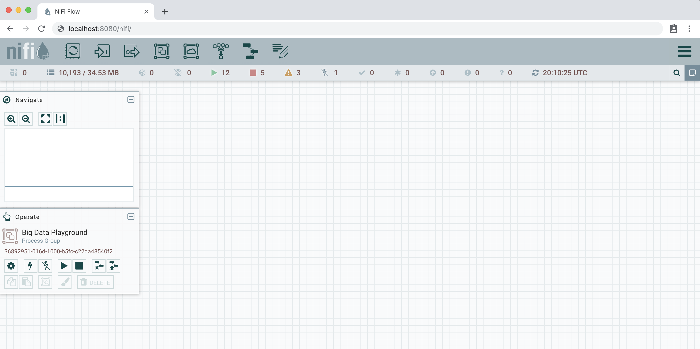

2. Create a new Process Group "Bitstamp Realtime Data Ingestion". Drag and drop Process Group to canvas and set the name "Bitstamp Realtime Data Ingestion"
    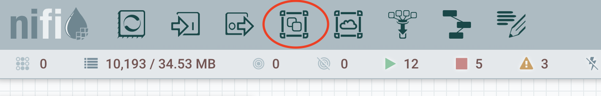
    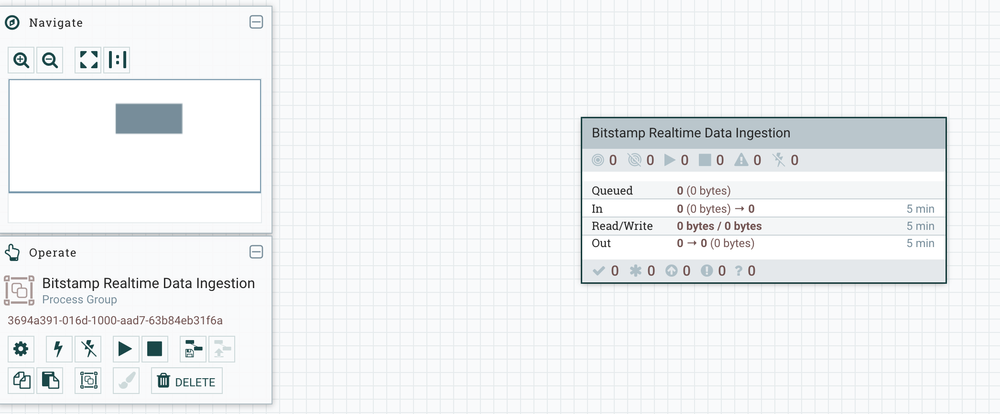

3. Navigate to "Bitstamp Realtime Data Ingestion" group a create a nested process group "Retrieve Bitstamp Data"
    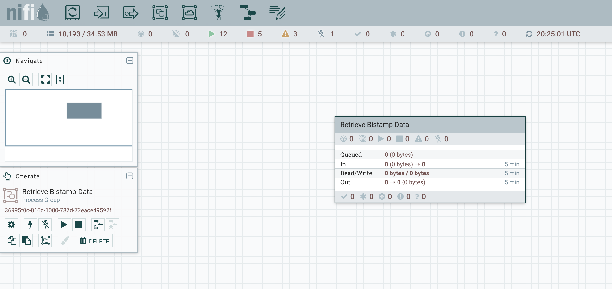

4. Right click on "Bitstamp Realtime Data Ingestion", click "Configure" and navigate to "Controller Services" tab.
    

5. Add **StandardRestrictedSSLContextService** service. Configure it with name **BitstampSSLContextService** and set the following properties:

Property            | Value
--------------------|-------------------------------
Truststore Filename | /labs/nifi/bitstamp.truststore
Truststore Password | truststore
Truststore Type     | JKS

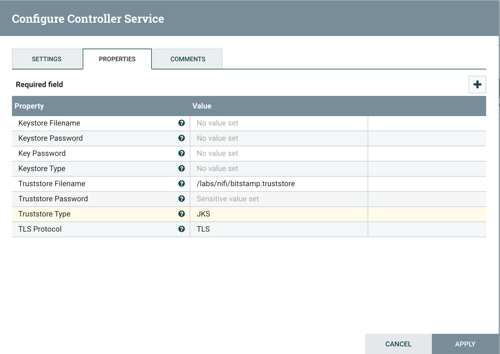

6. Add **JettyWebSocketClient** service. Configure it with name **BitstampWebSocketClient** and set the following properties:

Property            | Value
--------------------|-------------------------------
WebSocket URI       | wss://ws.bitstamp.net
SSL Context Service | BitstampSSLContextService

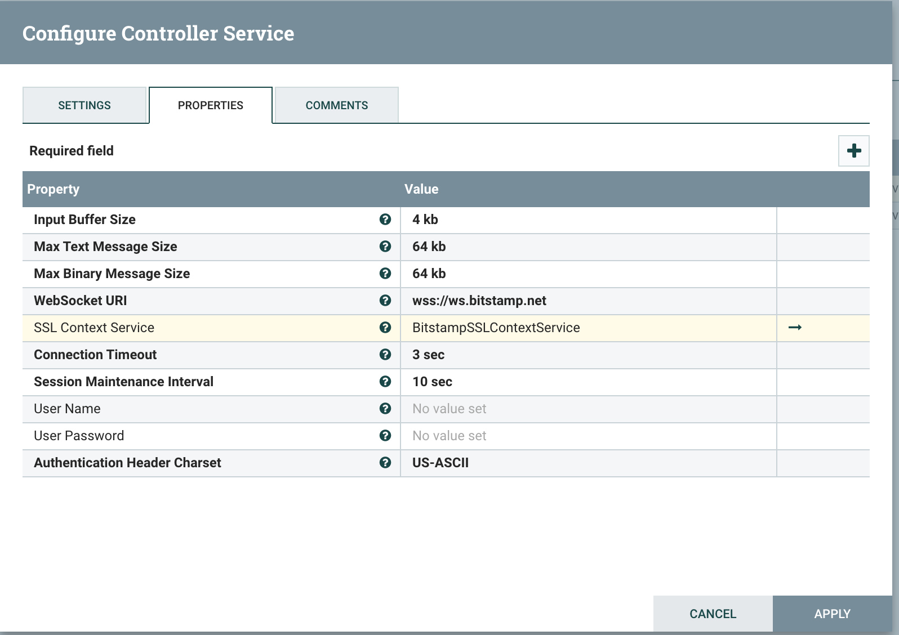

7. Configure Process Group variable by making right click on  **Bitstamp Realtime Data Ingestion** process group and selecting "Variables" menu item.

Name         | Value
-------------|-------------------------------
CurrencyPair | btcusd

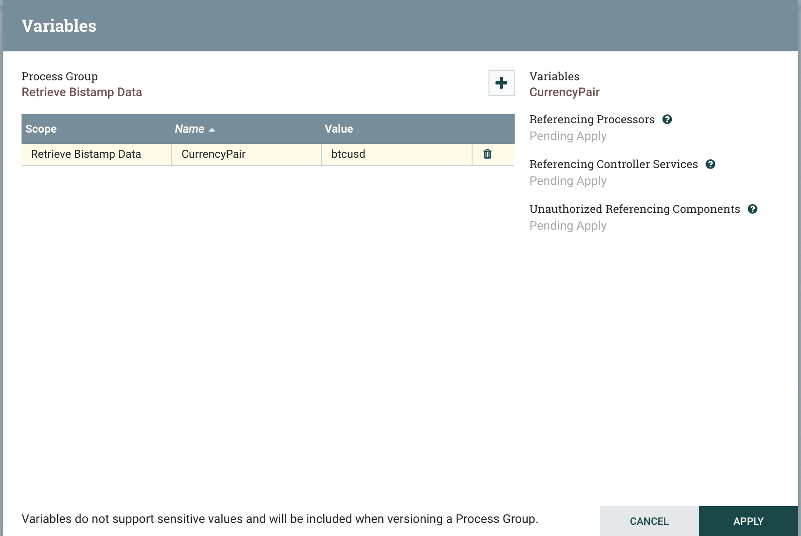

8. Build the flow to subscribe on orders channel.

Navigate inside **Bitstamp Realtime Data Ingestion** process group and put the following processors on the surface:

Processor Type   | Name
-----------------|----------------------------------
ConnectWebSocket | Connect to Bitstamp
ReplaceText      | Prepare channel subscription message
PutWebSocket     | Send channel subscription message
EvaluateJsonPath | Set event attribute

Add **Output Port** with name **Bitstamp Events"

Connect processors to form the flow

From                         | To                                   | Relationships
-----------------------------|--------------------------------------|-------------
Connect to Bitstamp          | Prepare channel subscription message | connected
Prepare channel subscription | Send channel subscription message    | success
Connect to Bitstamp          | Set event attribute                  | text message
Set event attribute          | Bitstamp Events                      | matched

Configure processors:

Processor **Connect to Bitstamp**

Property                           | Value
-----------------------------------|------------------------
WebSocket Client ControllerService | BitstampWebSocketClient
WebSocket Client Id                | BitstampIngestionClient

Processor **Prepare channel subscription message**

Property     | Value
-------------|------
Search Value | .*

Set property "Replacement Value":

```json
{
    "event": "bts:subscribe",
    "data": {
        "channel": "live_orders_${CurrencyPair}"
    }
}
```

Processor **Send channel subscription message**

Property                       | Value
-------------------------------|-----------------------------------
WebSocket Session Id           | ${websocket.session.id}
WebSocket ControllerService Id | ${websocket.controller.service.id}
WebSocket Endpoint Id          | ${websocket.endpoint.id}
WebSocket Message Type         | TEXT

Processor **Set event attribute**

Property                  | Value
--------------------------|-----------------------------------
Destination               | flowfile-attribute
Return Type               | auto-detect
Path Not Found Behavior   | ignore
Null Value Representation | empty string
event                     | $.event

Configure **Automatically Terminate Relationships** property

Processor | Automatically Terminate Relationships
Connect to Bitstamp | binary message
Prepare channel subscription message | failure
Send channel subscription message | failure; success
Set event attribute | failure; unmatched

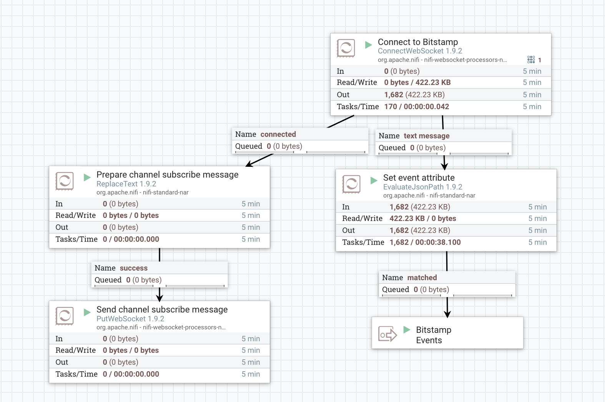

9. Navigate back to **Bitstamp Realtime Data Ingestion** process group, put **DebugFlow" processor and link **Retrieve Bitstamp Data" to **DebugFlow".

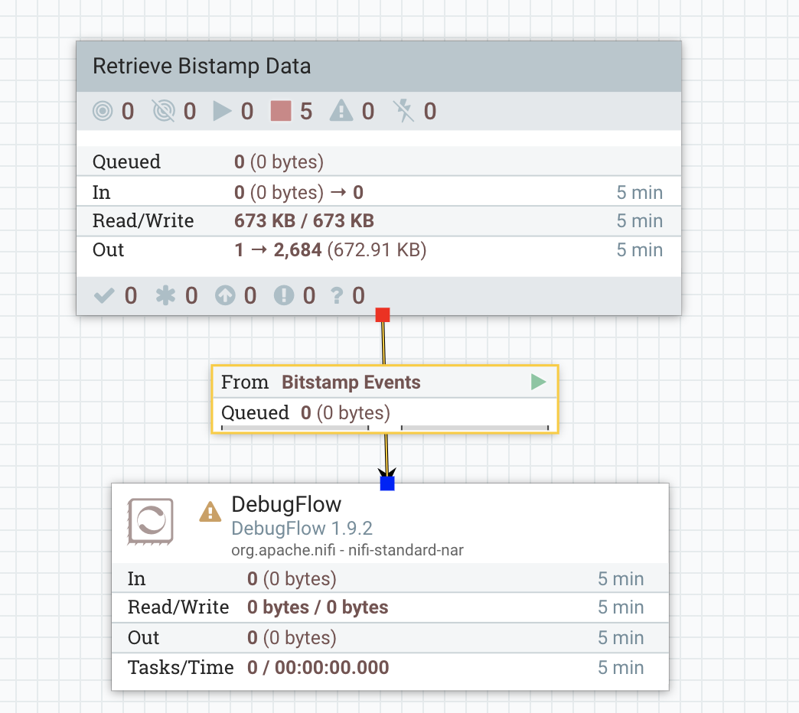

10. Start "Retrieve Bitstamp Data" process group.

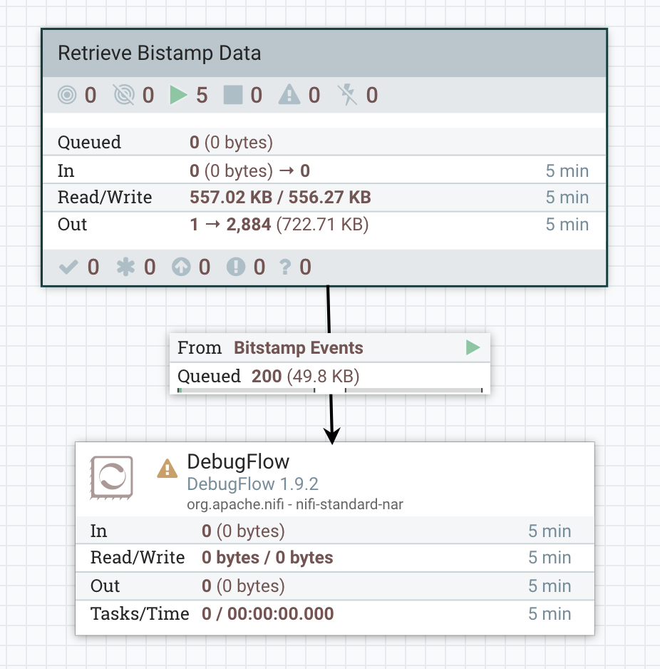

11. Observe collected messages in queue on connection between **Bitstamp Realtime Data Ingestion** and **DebugFlow** by clicking "List queue" on connection.

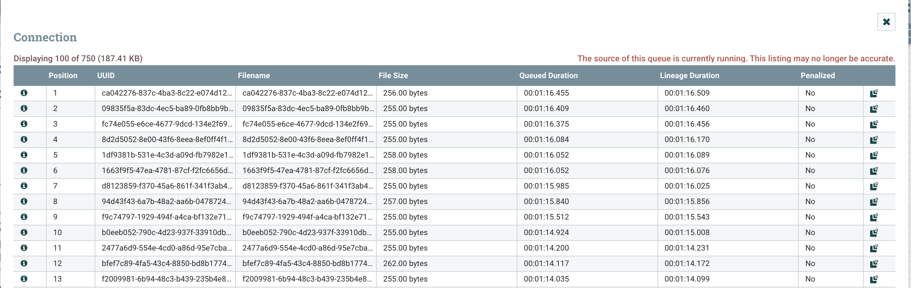

### Excersice 3: Data Ingestion to Kafka and Hadoop Hdfs ###

### Task 1: Sending messages to Kafka

Create new Kafka topic
```
$ docker exec -it lab01_kafka-node-01_1 /usr/bin/kafka-topics --create --bootstrap-server localhost:9092 --replication-factor 1 --partitions 1 --topic bitstamp
```

List existing Kafka topics
```
$ docker exec -it lab01_kafka-node-01_1 /usr/bin/kafka-topics --list --bootstrap-server localhost:9092
```

Consume Kafka Messages from Kafka topci
```
$ docker exec -it lab01_kafka-node-01_1 /usr/bin/kafka-console-consumer --bootstrap-server localhost:9092 --topic bitstamp --from-beginning
```

### Task 2: Putting the data to Hdfs

Create a new directory in Hdfs

```
$ docker exec -it lab01_hdfs-namenode-01_1 hadoop fs -mkdir /bitstamp
```

Change folder permissions in Hdfs
```
$ docker exec -it lab01_hdfs-namenode-01_1 hadoop fs -chmod 777 /bitstamp
```

List the folder content in Hdfs
```
$ docker exec -it lab01_hdfs-namenode-01_1 hadoop fs -ls /
```
